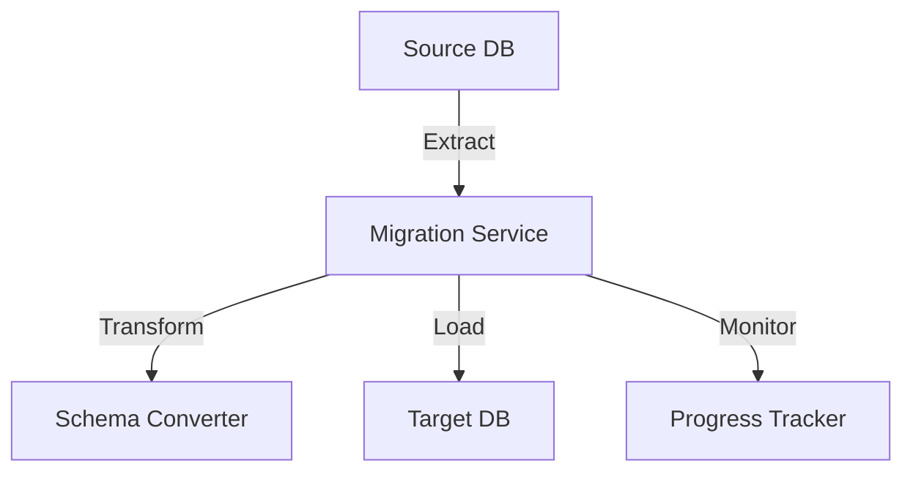

# Database Migration Tool

A robust tool built in Go for seamless migration between database platforms with zero downtime and automatic schema conversion.

## Overview

The Database Migration Tool is designed to handle complex database migrations while ensuring:
- Zero downtime during migration
- Automatic schema conversion
- Data integrity validation
- Real-time progress monitoring

## Technical Architecture

### System Design



## Implementation

### Core Migration Logic

```go
type MigrationConfig struct {
    SourceDB     *sql.DB
    TargetDB     *sql.DB
    BatchSize    int
    Concurrency  int
}

func Migrate(config MigrationConfig) error {
    // Implementation details
    return nil
}
```

## Features

- Multi-database support (PostgreSQL, MongoDB, Redis)
- Schema validation and conversion
- Data integrity checks
- Progress monitoring
- Rollback capability

## Results

| Metric | Value |
|--------|--------|
| Migration Speed | 1M records/min |
| Downtime | 0ms |
| Data Integrity | 100% |

## Future Improvements

- [ ] Add support for more databases
- [ ] Implement ML-based schema mapping
- [ ] Add distributed migration support