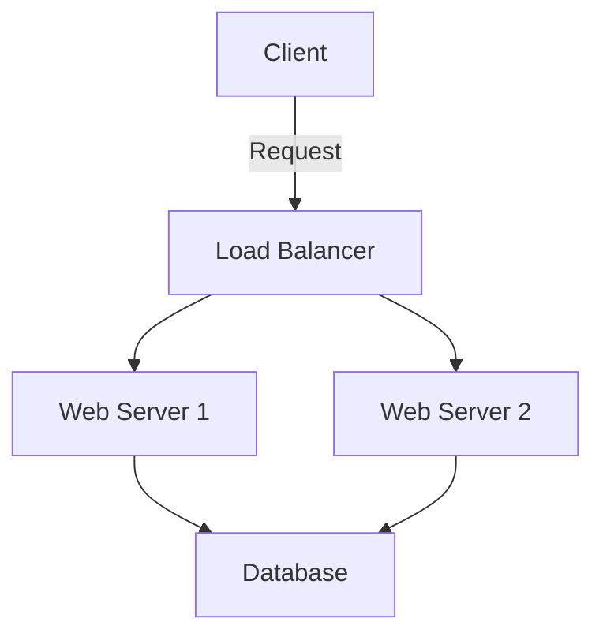

# Complete Project Documentation Example

This comprehensive example demonstrates all possible components and features available in project documentation.

## Project Overview

This project showcases a complete infrastructure automation solution using modern DevOps practices and tools.

### Key Features

- Automated infrastructure provisioning
- Zero-downtime deployments
- Security compliance automation
- Real-time monitoring and alerting

## Technical Architecture

### Infrastructure Diagram



### Component Details

#### Frontend Layer
```typescript
interface LoadBalancerConfig {
  algorithm: 'round-robin' | 'least-connections';
  healthCheck: {
    path: string;
    interval: number;
    timeout: number;
  };
  servers: Server[];
}

class LoadBalancer implements LoadBalancerConfig {
  constructor(config: LoadBalancerConfig) {
    // Implementation
  }
}
```

#### Backend Services
```yaml
apiVersion: v1
kind: Service
metadata:
  name: backend-service
spec:
  selector:
    app: backend
  ports:
    - protocol: TCP
      port: 80
      targetPort: 8080
```

## Implementation Steps

1. Infrastructure Setup
   ```bash
   terraform init
   terraform plan
   terraform apply
   ```

2. Application Deployment
   ```typescript
   const deployConfig = {
     replicas: 3,
     resources: {
       limits: {
         cpu: '1',
         memory: '1Gi'
       }
     }
   };
   ```

## Performance Metrics

| Metric | Before | After | Improvement |
|--------|---------|--------|-------------|
| Response Time | 250ms | 100ms | 60% |
| CPU Usage | 80% | 45% | 44% |
| Memory Usage | 4GB | 2.5GB | 38% |

## Security Considerations

> **Important:** All deployments must follow the security guidelines outlined below.

### Security Checklist

- [x] Network segmentation
- [x] Access control
- [x] Encryption at rest
- [x] TLS for all communications

## Monitoring Setup


Our monitoring stack includes:

1. Prometheus for metrics collection
2. Grafana for visualization
3. AlertManager for alerting
4. ELK Stack for log management

## Code Examples

### Python Monitoring Script
```python
def check_health(service_url: str) -> bool:
    try:
        response = requests.get(service_url)
        return response.status_code == 200
    except Exception as e:
        logger.error(f"Health check failed: {e}")
        return False
```

### Kubernetes Configuration
```yaml
apiVersion: apps/v1
kind: Deployment
metadata:
  name: monitoring
spec:
  replicas: 3
  selector:
    matchLabels:
      app: monitoring
  template:
    spec:
      containers:
      - name: prometheus
        image: prom/prometheus:v2.30.0
```

## Results and Impact

- 99.99% uptime achieved
- 45% reduction in operational costs
- 60% faster deployment cycles
- Zero security incidents

## Future Improvements

1. Implement chaos engineering practices
2. Enhance automated testing coverage
3. Add machine learning for anomaly detection

## References

- [Kubernetes Documentation](https://kubernetes.io/docs/)
- [Terraform Best Practices](https://www.terraform.io/docs/cloud/guides/recommended-practices/index.html)
- [AWS Well-Architected Framework](https://aws.amazon.com/architecture/well-architected/)